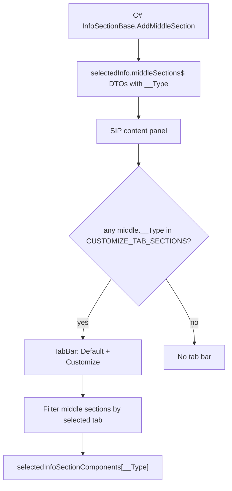

# Selected Info Panel tabs and XTM injection

Research reference for Cities Skylines II Selected Info Panel (SIP) tabs, how building “coloring/painting” uses them, how that differs from line `ColorSection`, and how BelzontTLM / XTM injects content today. Includes deferred notes for a future XTM-dedicated tab.

**This document is research only.** No SIP tab implementation is described as done.

Related: [`custom-enum-id-ranges.md`](custom-enum-id-ranges.md) — reserved `0xF4500XXX` for BelzontTLM custom enum ids (including a future SIP tab id).

## Sources

| Source | Path / note |
|---|---|
| Extracted UI modules | `_ModsMCP/dist/ui-modules/` (via kcs2m `kcs2m_ui_modules_lookup`) |
| Section registry | `game-ui/game/components/selected-info-panel/selected-info-sections/selected-info-sections.tsx` |
| SIP shell | `game-ui/game/components/selected-info-panel/selected-info-panel.tsx` |
| Bindings / enums | `game-ui/game/data-binding/selected-info-bindings.ts` |
| Tab primitives | `game-ui/common/tabs/tabs.tsx` (`TabBar`, `Tab`, `TabNav`) |
| Building paint UI | `.../visual-customize-section/visual-customize-section.tsx` (+ bindings) |
| Line/entity color UI | `.../color-section/color-section.tsx` (+ bindings) |
| XTM UI remaps | `_Frontends/UI/k45-xtm-vuio/src/index.tsx` |
| XTM middle section UI | `_Frontends/UI/k45-xtm-vuio/src/components/XtmInfoSection.tsx` |
| XTM color override | `_Frontends/UI/k45-xtm-vuio/src/components/ColorEditorXtm.tsx` |
| XTM C# section | `BelzontTLM/Systems/XTMInfoPanelSystem.cs` |

Prefer extracted modules as source of truth; mod `bindings.d.ts` may lag (e.g. missing `VisualCustomize`, `SelectedInfoPanelTab`).

---

## Critical distinction: painting tabs vs line color

The “coloring/painting” tab on many assets is **not** `ColorSection`.

| Feature | Section type (`__Type`) | Tab |
|---|---|---|
| Building mesh paint / palettes | `Game.UI.InGame.VisualCustomizeSection` | **Customize** |
| Entity / line solid color | `Game.UI.InGame.ColorSection` | **Default** (no dedicated tab) |

XTM’s `ColorEditorXtm` replaces **Default** `ColorSection` when the selected entity is the route. Adding `BelzontTLM.XTMInfoPanelSystem` to `CUSTOMIZE_TAB_SECTIONS` alone would park XTM content on the **paint** Customize tab — wrong UX for lines.

---

## Vanilla SIP tab model

Vanilla supports a **binary** model: Default ↔ Customize.

### Registration surfaces

| Export | Module | Role |
|---|---|---|
| `selectedInfoSectionComponents` | `selected-info-sections.tsx` | Map `__Type` → React component |
| `CUSTOMIZE_TAB_SECTIONS` | `selected-info-sections.tsx` | `Set` of `__Type`s shown on Customize; today **only** `VisualCustomize` |
| Content panel (inner SIP) | `selected-info-panel.tsx` | Tab bar, middle filter, gamepad “Switch Tab” |
| `SelectedInfoPanelTab` | `selected-info-bindings.ts` | `Default = 0`, `Customize = 1` |
| `SectionType.VisualCustomize` | `selected-info-bindings.ts` | `"Game.UI.InGame.VisualCustomizeSection"` |

### Filtering rules

- **Customize tab:** middle sections whose `__Type` is in `CUSTOMIZE_TAB_SECTIONS`
- **Default tab:** middle sections **not** in that set
- Tab bar appears only when at least one middle section is in the set
- Gamepad “Switch Tab” cycles `[Default, Customize]` when Customize is available
- **Top** and **bottom** sections are never tab-filtered — only **middle**

### Painting reference (what actually uses tabs)

1. C# adds `VisualCustomizeSection` as a middle section when the asset supports mesh colors.
2. UI sees `__Type` in `CUSTOMIZE_TAB_SECTIONS` → shows Info + Palette tab icons.
3. Customize tab renders `VisualCustomizeSection` (foldout, mesh channels, global palettes).
4. Default keeps everything else (including `ColorSection` when present).

### Vanilla Customize-tab checklist (other mods / reference)

1. C#: `InfoSectionBase` + `m_InfoUISystem.AddMiddleSection(this)`.
2. UI: register React under `selectedInfoSectionComponents[typeof(YourSystem).FullName]`.
3. UI: `CUSTOMIZE_TAB_SECTIONS.add("Your.Namespace.YourSection")` (exported setter on `selected-info-sections.tsx`).
4. Section visible → SIP shows tab bar; selecting Customize filters to that section.

---

## How XTM injects today

### UI remaps (`index.tsx`)

1. `selectedInfoSectionComponents`:
   - Swap `Game.UI.InGame.ColorSection` → `ColorEditorXtm` when `selectedEntity` is the route; otherwise keep vanilla.
   - Map `BelzontTLM.XTMInfoPanelSystem` → `XtmInfoSection`.
2. Separate remaps for line visualizer sidebar (`LineVisualizerSection` / `LineVisualizerCanvas`) — **not** part of the middle tab filter.

### C# (`XTMInfoPanelSystem`)

- `AddMiddleSection(this)` when a route is selected (visibility gate).
- Empty `OnWriteProperties` — UI loads data via `getCurrentLineInfo` / related binders.
- UI key = CLR type name `BelzontTLM.XTMInfoPanelSystem`.

### Result

XTM middle content (`XtmInfoSection`) sits on **Default**, mixed with vanilla line schedule, tickets, vehicle count, etc. Line map sidebar is a separate focus pane.

---

## Future implementation notes (deferred — not done)

A dedicated XTM tab needs extending the binary Default/Customize model in UI. C# mainly keeps adding `XTMInfoPanelSystem` as a middle section.

**Do not** put XTM only into `CUSTOMIZE_TAB_SECTIONS` — that shares the paint Customize tab.

When implemented later:

1. Extend / wrap SIP content that owns `selectedTab`, middle filter, and `TabBar` (prefer a readable wrap over patching minified internals).
2. Use a tab id from BelzontTLM reserved block **`0xF4500XXX`** (see [`custom-enum-id-ranges.md`](custom-enum-id-ranges.md)); planned example: `0xF4500001` for the XTM line-data tab. Do **not** use `2`.
3. Filter map:
   - **Default:** middle sections not in Customize set and not XTM section
   - **Customize:** members of vanilla `CUSTOMIZE_TAB_SECTIONS` (unchanged paint behavior)
   - **XTM:** `__Type === "BelzontTLM.XTMInfoPanelSystem"` (and any future XTM-only middle sections)
4. Show a third `Tab` (e.g. XTM icon) when the XTM section is present; keep Info / Palette when Customize applies.
5. Include the XTM tab in gamepad “Switch Tab” cycle when visible; compare `selectedTab` with the reserved constant.
6. Content decisions:
   - **Move to XTM tab:** `XtmInfoSection` (already keyed to `XTMInfoPanelSystem`)
   - **Default color:** leave `ColorEditorXtm` on Default next to COLOR, or restore vanilla `ColorSection` and move palette extras — separate decision
   - **Leave outside tabs:** line visualizer sidebar

Fragile points: `SelectedInfoPanel` remaps are patch-sensitive; use extracted UI modules as source of truth.
