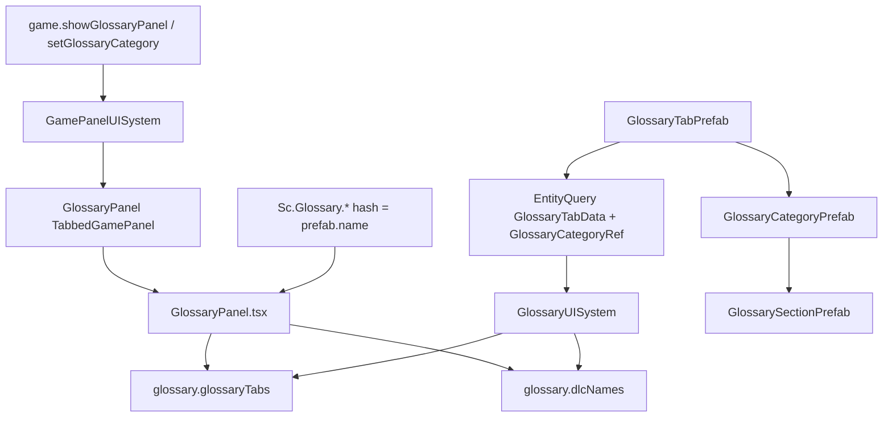
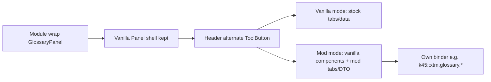

# Vanilla Glossary / Encyclopedia system (frontend + backend)

Research reference for Cities Skylines II **Glossary** (player-facing Encyclopedia panel): UI components, bindings, Managed C# prefabs/binder, localization-by-name, and how that informs an **XTM mod glossary** hosted inside the stock Glossary window.

**This document is research + product decisions only.** No XTM glossary UI/binder implementation is described as done. The Commons markdown locale loader described under i18n is a separate, already-planned capability.

Related: [`vanilla-tutorials.md`](vanilla-tutorials.md) — parallel tutorial stack; encyclopedia ↔ tutorial cross-links use **separate ids**.

---

## Sources

| Source | Path / note |
|---|---|
| Extracted UI modules | `_ModsMCP/dist/ui-modules/` via `kcs2m_ui_modules_lookup` |
| Glossary UI | `game-ui/game/components/glossary-panel/glossary-panel.tsx` |
| Glossary bindings | `game-ui/game/data-binding/glossary-bindings.ts` |
| Loc dictionary | `game-ui/common/localization/loc.generated.ts` (`Sc.Glossary.*`) |
| Backend cache | via `kcs2m_backend_search` / `kcs2m_backend_context` on `Game.dll` |
| UI binder | `Game/UI/InGame/GlossaryUISystem.cs` |
| Panel type | `Game/UI/InGame/GlossaryPanel.cs` |
| Open triggers | `Game/UI/InGame/GamePanelUISystem.cs` (`showGlossaryPanel`, `setGlossaryCategory`) |
| Prefabs | `Game/Prefabs/GlossaryTabPrefab.cs`, `GlossaryCategoryPrefab.cs`, `GlossarySectionPrefab.cs` |
| ECS markers | `Game/Glossary/Glossary*Data.cs`, `Glossary*Ref.cs` |
| Overview-style wrap precedent | [`XtmTransportationOverviewRegister.tsx`](../../_Frontends/UI/k45-xtm-vuio/src/components/mainWindow/XtmTransportationOverviewRegister.tsx) |
| Locale loader | [`BasicIMod.LoadLocales`](../../BelzontTLM/BelzontCommons/Utils/BasicIMod.cs) |

Prefer MCP over browsing game install trees. Typed `bindings.d.ts` may lag (no glossary types yet).

---

## Naming

Game code and UI modules use **Glossary**. The panel title is `Sc.Glossary.TITLE` (Encyclopedia/Glossary in player language). This doc uses Glossary for APIs and “encyclopedia” only when speaking about product cross-links with tutorials.

---

## End-to-end architecture (vanilla)



---

## Binding / panel / open API

| Layer | Detail |
|---|---|
| Binding group | `"glossary"` |
| Values | `glossaryTabs`, `dlcNames` |
| JSON types | `glossary.Tab`, `glossary.Category`, `glossary.Section` (`TypeNames.kGlossary*`) |
| Panel class | `GlossaryPanel : TabbedGamePanel` — `blocking`, `LayoutPosition.Center`, `retainProperties` |
| Tab enum (C#) | `All`, `Zones`, `Utilities`, `Services`, `Roads`, `Transport`, `Events`, `Progression`, `Tools`, `Economy`, `Interface` |
| Open | `TriggerBinding<int>("game", "showGlossaryPanel", ShowPanel<GlossaryPanel>)` |
| Category focus | `TriggerBinding<int>("game", "setGlossaryCategory", SetCategory<GlossaryPanel>)` |

### Bound DTO shape (`glossaryTabs`)

Each tab: `entity`, `icon`, `name` (prefab.name), `categories[]`.

Each category: `entity`, `icon`, `name`, `sections[]`, `dlc` (string or null for BaseGame).

Each section: `entity`, `name` only — **no body field**.

Categories are filtered by `PlatformManager.IsDlcOwned` when binding. UI also offers a pack filter bar from distinct non-empty `dlc` values on the current tab’s categories.

---

## Prefab hierarchy (how vanilla adds entries)

| Level | Prefab | Fields | ECS | Notes |
|---|---|---|---|---|
| Tab | `GlossaryTabPrefab` | `m_Icon`, `m_Categories[]` | `GlossaryTabData` + `GlossaryCategoryRef` buffer | Component menu `Glossary/` |
| Category | `GlossaryCategoryPrefab` | `m_Icon`, `m_Dlc`, `m_Sections[]` | `GlossaryCategoryData` + `GlossarySectionRef` buffer | DLC gate in binder |
| Section | `GlossarySectionPrefab` | *(PrefabBase only)* | `GlossarySectionData` | Name is the localization hash |

Adding a vanilla entry = cook/register prefabs in that tree so they appear in the `GlossaryTabData` query. Body text is **not** stored on the prefab.

---

## Localization model (vanilla)

Frontend uses hashed Loc keys (`Tc` → `` `${id}[${hash}]` ``):

| Loc component | Role |
|---|---|
| `Sc.Glossary.TITLE` | Panel title |
| `Sc.Glossary.TAB` | Tab tooltip (`hash` = tab prefab name) |
| `Sc.Glossary.CATEGORY` | Category title |
| `Sc.Glossary.SECTION_TITLE` | Section title |
| `Sc.Glossary.SECTION_CONTENT` | Section body (markdown / rich text) |
| `Sc.Glossary.SEARCH_PLACEHOLDER`, `PACK_FILTER`, `TABLE_OF_CONTENTS` | Chrome |

Search lowercases `CATEGORY` / `SECTION_TITLE` / `SECTION_CONTENT` via `renderString`. Section bodies render through the vanilla markdown/rich path (bold highlight on search matches).

**Authoring model:** stable prefab **name** + localization dictionary entries keyed by that name.

---

## Tab enum vs binder mismatch

[`glossary-panel.tsx`](game-ui/game/components/glossary-panel/glossary-panel.tsx) does **not** build the tab bar solely from `glossaryTabs`. It hard-maps `GlossaryPanel.Tab` enum values to name substrings (`'all'`, `'roads'`, `'transport'`, …) and looks up matching binder entries.

Consequences:

- A new `GlossaryTabPrefab` can appear in `glossaryTabs` but will **not** get tab chrome in stock UI.
- Extending stock `GlossaryPanel.Tab` is not a mod-friendly path.
- Injecting categories under an existing vanilla tab (e.g. Transport) would still require PrefabSystem registration and mixes mod content into stock chrome — **not** the chosen XTM approach.

---

## XTM host strategy (overview-style)

Mirror transportation overview wrap ([`XtmTransportationOverviewRegister.tsx`](../../_Frontends/UI/k45-xtm-vuio/src/components/mainWindow/XtmTransportationOverviewRegister.tsx)):

1. Always call vanilla `GlossaryPanel` so the **Panel shell stays mounted** (close / focus / transitions / tutorial targets).
2. Inject a **header ToolButton** that toggles:
   - **Vanilla mode:** stock header + stock children (`glossary.*`).
   - **Mod mode:** same shell; body rewritten to a mod glossary view using **vanilla glossary React pieces** (category browser, section content, search patterns) fed by **mod enums + mod binder/DTO**, not stock `glossary.*` / `GlossaryPanel.Tab`.
3. Never replace the Panel shell entirely when swapping modes (same failure mode as overview).



### Own menu root

“XTM root” = **mod mode** inside the stock Glossary window, with mod-owned tab/category lists from the mod binder. Not a new value on stock `GlossaryPanel.Tab`.

### Multi-mod coexistence

- v1: **XTM-only** toggle; do not claim exclusive ownership that drops other mods’ header injections.
- When a shared registry exists later: **stacked ToolButtons** (one per provider). Prefer a composable header-tools slot so wrappers do not erase each other’s children.
- Stock `glossaryTabs` remains the vanilla source; each mod’s alternate mode uses **its own** binding group and ids.

### How to add XTM entries

1. Structure: Tab → Category → Section (DTO: name/key, icon, nested lists; section has no body field).
2. Titles/bodies via localization with **assembled `K45::XTM` keys** (`translate(key)` in mod mode).
3. Long bodies in `i18n/{lang}/*.md` (see below). Short chrome in `*_entries.txt`.
4. **No `Glossary*Prefab`** unless the approach is explicitly changed later.
5. Optional `tutorialId` on section DTO for cross-links (separate tutorial ids).

### Loc / markdown in mod mode

- Plain `translate(assembledKey)` for titles and bodies; custom markdown renderer path matching the **vanilla glossary subset** (bold, paragraphs, lists as supported today).
- Do **not** register under `Sc.Glossary.*[hash]` for mod content.
- Icons from DTO paths. Optional **pack** filter ids = **release version tags** (empty / unused at first release).
- **Images and links for encyclopedia/glossary section bodies must be embedded in the `i18n/{lang}/*.md` bodies** using the Markdown dialect (``, `[label](data)`). Do not rely on separate non-md side channels for those assets in section content.

### Discovery

| Behavior | Decision |
|---|---|
| Default on open | **Vanilla mode**; user toggles to XTM |
| Deep-links | SIP, tooltips, and tutorials can open **mod mode** focused on a section |
| Tutorials | Both ways: section → tutorial; tutorial → glossary mod-mode on section |

### v1 scope (when implementing UI later)

Shell + toggle + **one smoke** category/section — prove binder, md i18n, deep-link hooks. Real docs later.

---

## i18n: short keys vs long markdown bodies

Standard 7-column `*_entries.txt` is a poor fit for glossary `SECTION_CONTENT` (long markdown, newlines, tabs).

### Layout

```text
BelzontTLM/i18n/
  i18n.csv                 # short strings (human Excel merge)
  {feature}_entries.txt    # agent pending short keys
  en-US/
    SomeAssembledKey.md    # filename matches frontmatter key when possible
  pt-BR/
    SomeAssembledKey.md
```

### Markdown file format

```markdown
---
key: K45::XTM.vuio[glossary.section.smoke]
---
Long **markdown** body for this locale.
```

- Frontmatter **`key`** (alias **`entry`**) = assembled locale id.
- Body after frontmatter = locale value (newlines preserved; no CSV escaping).
- Filename should match the key when the filesystem allows; otherwise frontmatter is authoritative.
- **`en-US/` is the base locale for md:** registered for every language first (same pattern as the CSV en-US column). If a key has no file under `i18n/{lang}/`, the en-US body is used. Language-specific md overlays en-US for keys that exist in that folder.
- **Conflict rule:** last loaded entry for a key wins. Order per language: CSV → ModGen → en-US md → lang md. So lang md overrides en-US md; md overrides CSV for the same key.
- Agents never edit `i18n.csv`; short keys still go to `*_entries.txt`.
- **Embed images and links in section md bodies** (``, `[label](data)`). Category/section chrome icons may still come from DTO paths; body media and hyperlinks live in the locale md.

Loader: `BasicIMod.LoadLocales` — see Commons implementation.

---

## XTM product decisions (summary)

| Area | Decision |
|---|---|
| Host | Overview-style wrap — keep vanilla `GlossaryPanel` shell; header toggle vanilla ↔ mod mode |
| Components | Reuse vanilla glossary UI pieces; **mod enums + mod binder/DTO** in mod mode |
| Multi-mod | XTM-only toggle first; later **stacked ToolButtons** per provider |
| Default on open | **Vanilla mode** |
| Deep-links | SIP, tooltips, tutorials → mod-mode on specific section |
| Content | Binder + DTO + md i18n; **no prefabs** unless approach explicitly changed |
| Section keys | Assembled **`K45::XTM` keys only** |
| Loc in mod mode | **`translate(assembledKey)`** + custom markdown path |
| Markdown | Match **vanilla glossary renderer** subset |
| Icons / packs | Icons from DTO; optional **release-version pack tags** (empty at first release) |
| Tutorials | Separate ids; optional **`tutorialId`** on section DTO; **both-way** cross-link |
| v1 | Shell + toggle + **one smoke** category/section |
| i18n long bodies | `i18n/{langCode}/*.md` frontmatter key + body; **en-US md is base** for other langs; last load wins |

---

## Vanilla research backlog

| Topic | Status |
|---|---|
| Prefab packaging / asset-database cook for stock injection | Deferred — not needed for mod mode |
| Whether mod-registered `Glossary*Prefab` auto-joins stock query | Open — low priority given chosen host |
| Exact vanilla markdown feature set beyond bold/paragraphs | Match renderer at implementation time via MCP |
| `bindings.d.ts` glossary types | Refresh during UI implementation |

---

## When implementing XTM glossary (later)

1. Wrap `glossary-panel` like transportation overview; keep shell; header toggle; default vanilla.
2. Mod binder group + smoke Tab → Category → Section DTO; icons; empty pack tags.
3. Wire reused vanilla React pieces to mod data; `translate` + markdown path for bodies.
4. Deep-link hook: open Glossary → force mod mode → select section.
5. Optional `tutorialId` on section; reverse open from tutorials.
6. Short chrome via `*_entries.txt`; bodies via `i18n/{lang}/*.md`.
