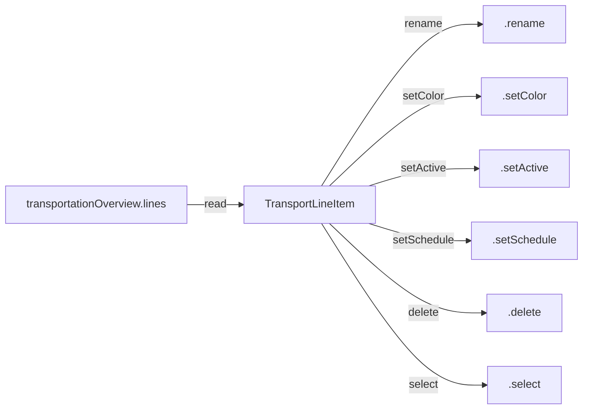

# Vanilla PT line management bindings vs mod re-exposure

Reference for Cities Skylines II vanilla frontend public-transport line management bindings (`transportationOverview.*`), and how BelzontTLM re-exposes (or does not re-expose) the same capabilities via `IBelzontBindable` call binders.

## Sources

| Source | Path / note |
|---|---|
| Vanilla bindings (extracted UI) | `game-ui/game/data-binding/transport-bindings.ts` (via kcs2m `kcs2m_ui_modules_lookup`) |
| Binding helpers | `game-ui/common/data-binding/binding.ts` |
| Overview UI | `game-ui/game/components/transportation-overview-panel/` (`transport-line-item.tsx`, `lines-utils.ts`, `transportation-overview-page.tsx`, `transportation-overview-panel.tsx`) |
| Typed vanilla API | `_Frontends/UI/k45-xtm-vuio/types/bindings.d.ts` |
| Mod call registration | `BelzontTLM/BelzontCommons/Utils/BasicIMod.cs` → `k45::xtm.{address}` |
| Mod frontend wrapper | `_Frontends/UI/k45-xtm-vuio/src/service/LineManagementService.ts` |
| Mod controllers | `XTMLineViewerController`, `XTMLineManagementController`, `XTMInfoPanelSystem` |

Binding group prefix: **`transportationOverview`**.

## Binding mechanics

From `binding.ts`:

- `bindValue(group, name)` → reactive value `group.name` (subscribe/update)
- `bindTriggerWithArgs(group, name)` → fire-and-forget `engine.trigger("group.name", ...args)` — **no return value**

---

## Vanilla actions

### 1. Get / set line name

| | |
|---|---|
| **Get** | Value binding **`transportationOverview.lines`** (`transportLines$`). Each item: `{ name: Name \| null, vkName: Name \| null, lineData: TransportLineData }` |
| **Set** | Trigger **`transportationOverview.rename`** (export `renameLine`) |
| **Parameters (set)** | `(entity: Entity, name: string)` — called on name-field blur via `useLineName` |
| **Expected output** | Get: localized/custom `Name` object. Set: void; next `lines` update reflects rename |

### 2. Get / set line color

| | |
|---|---|
| **Get** | `lineData.color` on `transportLines$` entry — `Color { r,g,b,a }` in 0–1 |
| **Set** | Trigger **`transportationOverview.setColor`** (`setLineColor`) |
| **Parameters (set)** | `(entity: Entity, color: Color)` |
| **Expected output** | Get: RGBA. Set: void; color field updates via `lines` |

### 3. Get line statistics (usage / passengers / tourists / length)

**Per-line stats are not separate calls** — they are fields on each `TransportLineData` inside `transportLines$`:

| Field | Meaning (inferred from UI) |
|---|---|
| `length` | Route length (meters; UI unit `Length`) |
| `cargo` | Passenger count when `!isCargo`; cargo weight when `isCargo` |
| `usage` | Occupancy ratio 0–1 (UI shows `100 * usage` as %) |
| `stops`, `vehicles` | Counts (also shown in overview) |

**Tourists are not per-line** in the overview. City-level tourist/citizen rates come from **`transportSummaries$`** (`PassengerSummary.touristCount` / `citizenCount`, unit IntegerPerMonth) in the transport infoview — not from line management.

Selected-info `LineSection` also exposes `length`, `stops`, `usage`, `cargo` as section props (same semantics).

### 4. Get / set line activity (day / night / both / disabled)

Split across **two** bindings:

| Concern | Binding | Params | Values |
|---|---|---|---|
| Enabled/disabled | **`transportationOverview.setActive`** (`setLineActive`) | `(entity, active: boolean)` | `false` = inactive/disabled |
| Schedule | **`transportationOverview.setSchedule`** (`setLineSchedule`) | `(entity, schedule: number)` | `0` Day, `1` Night, `2` Day+Night (cycle in UI) |

**Get:** `lineData.active` + `lineData.schedule` from `transportLines$`.

Note: “disabled” is `active === false`; day/night/both only apply when the line is active.

### 5. List city lines

| | |
|---|---|
| **Binding** | Value **`transportationOverview.lines`** (`transportLines$`: `TransportLine[]`) |
| **Parameters** | none (subscribe) |
| **Expected output** | All passenger + cargo lines; UI filters by tab/`isCargo` and selected transport type |

Related filters: `passengerTypes$`, `cargoTypes$`, `selectedPassengerType$`, `selectedCargoType$`.

### 6. Delete line

| | |
|---|---|
| **Binding** | Trigger **`transportationOverview.delete`** (`deleteLine`) |
| **Parameters** | `(entity: Entity)` |
| **Expected output** | void; line removed from next `lines` push. UI confirms via dialog first |

---

## Vanilla `TransportLine` / `TransportLineData` shape

```ts
interface TransportLine {
  name: Name | null;
  vkName: Name | null;
  lineData: TransportLineData;
}

interface TransportLineData {
  entity: Entity;
  active: boolean;
  visible: boolean;
  isCargo: boolean;
  color: Color;       // { r, g, b, a } 0–1
  schedule: number;   // 0 Day, 1 Night, 2 Day+Night
  type: string;
  length: number;
  stops: number;
  vehicles: number;
  cargo: number;      // passengers or cargo weight
  usage: number;      // 0–1
}
```

## Full vanilla transport overview API (context)



Also present (outside the core feature list): `showLine`, `hideLine`, `toggleHighlight`, `resetVisibility`, `select`.

### Binding summary table

| Export | Engine name | Kind | Parameters | Output |
|---|---|---|---|---|
| `transportLines$` | `transportationOverview.lines` | value | — | `TransportLine[]` |
| `renameLine` | `transportationOverview.rename` | trigger | `(entity, name: string)` | void |
| `setLineColor` | `transportationOverview.setColor` | trigger | `(entity, color: Color)` | void |
| `setLineActive` | `transportationOverview.setActive` | trigger | `(entity, active: boolean)` | void |
| `setLineSchedule` | `transportationOverview.setSchedule` | trigger | `(entity, schedule: number)` | void |
| `deleteLine` | `transportationOverview.delete` | trigger | `(entity)` | void |
| `selectLine` | `transportationOverview.select` | trigger | `(entity)` | void |
| `showLine` | `transportationOverview.showLine` | trigger | `(entity, hideOthers: boolean)` | void |
| `hideLine` | `transportationOverview.hideLine` | trigger | `(entity, showOthers: boolean)` | void |
| `toggleHighlight` | `transportationOverview.toggleHighlight` | trigger | `(entity)` | void |
| `resetVisibility` | `transportationOverview.resetVisibility` | trigger | none | void |

City-level tourist/citizen aggregates (not per-line): `transportSummaries$` → `PassengerSummary.touristCount` / `citizenCount`.

---

## Mod re-exposure via `IBelzontBindable`

Calls are registered as `k45::xtm.{address}` (`BasicIMod.cs`). Frontend wrapper: `LineManagementService.ts`.

| Vanilla feature | Re-exposed? | Mod call / source |
|---|---|---|
| List city lines | **Yes** | `lineViewer.getCityLines` → `XTMLineViewerController`; returns `LineItemStruct[]` (same stats shape as vanilla + `xtmData`, `routeNumber`, `isFixedColor`) |
| Get stats (usage/passengers/length) | **Yes (read via list/detail)** | Fields on `LineItemStruct` / `getCurrentLineInfo` (`xtmInfoPanel.getCurrentLineInfo` in `XTMInfoPanelSystem`). `cargo` = passengers or cargo weight; no separate tourist field |
| Get tourists | **No** | Not on line DTOs; city `transportSummaries` not wrapped |
| Get name | **Yes (read via list/detail)** | `LineItemStruct.name` / `vkName` |
| Set name (`rename`) | **No** | No binder |
| Get color | **Yes** | `lineManagement.getRouteFixedColor` + `LineData.color` (hex `#RRGGBB`, not RGBA) |
| Set color | **Partial** | `lineManagement.setRouteFixedColor(entity, hexString)` — parallel to vanilla `setColor`, different type/API |
| Get schedule / active | **Yes (read via list/detail)** | `LineItemStruct.schedule`, `.active` |
| Set schedule | **No** | No binder |
| Set active | **No** | No binder |
| Delete line | **No** | No binder |

### Mod-specific `lineManagement.*` binders (not vanilla mirrors)

| Call | Role |
|---|---|
| `lineManagement.setRouteAcronym` / `getRouteAcronym` | Custom acronym on `XTMRouteExtraData` |
| `lineManagement.setRouteNumber` / `getRouteNumber` | Internal route number |
| `lineManagement.setIgnorePalette` / `getIgnorePalette` | Palette lock / ignore |
| `lineManagement.setRouteFixedColor` / `getRouteFixedColor` | Hex color get/set |
| `lineManagement.setFirstStop` | Rotate first stop on route |

### Gaps

BelzontTLM re-exposes **listing + read of line stats/name/color/schedule/active**, and a **custom set-color** path. It does **not** re-expose vanilla **rename**, **setSchedule**, **setActive**, or **delete**. Tourists remain city-aggregate-only in vanilla and are not exposed by the mod.

---

## XTM Transportation Overview listing injection

XTM can replace the Transportation Overview **body** (not the engine bindings) via:

```ts
moduleRegistry.extend(
  "game-ui/game/components/transportation-overview-panel/transportation-overview-panel.tsx",
  "TransportationOverviewPanel",
  XtmTransportationOverviewRegister
);
```

| Concern | Behavior |
|---|---|
| Session toggle | Header `ToolButton` switches XTM card listing vs vanilla table for the current session only |
| Default | `XTMModData.UseXtmLineListingDefault` (Options → UI → Line listing), default `true` |
| Read from UI | `k45::xtm.settings.getUseXtmLineListingDefault` |
| Card click | Vanilla `transport.selectLine(entity)` |
| List data | Existing `k45::xtm.lineViewer.getCityLines` (+ `getCityLines->` push on route updates) |

### Why toggling must not remount a second `Panel`

`GameMainScreen` only mounts the overview while `activeGamePanel` (`Nv`) is set:

```ts
f && jsx(FocusGate, { focusKey: f.__Type, children: jsx(GamePanelRenderer, { panel: f }) }, f.__Type)
```

`GamePanelRenderer` wires Transportation Overview as:

- `onClose: () => closePanel(panel.__Type)`
- vanilla `$je` → `Panel` (`xE`) with `onClose`, `transitionSounds: panelTransitionSounds`, `CloseConsumer` (`Jg`), and usually `FocusRoot` (`Gp`)

If the extender **conditionally mounts its own `Panel`** (or any tree that unmounts the vanilla `Panel` / overview component on toggle), the game treats that as panel teardown: `activePanel` clears and the entire slot — including a wrapper `div` — disappears. That matches “toggle unloads everything.”

**Required pattern:** always call `Component(props)` every render (hooks + shell lifetime), then rewrite the returned `Panel`’s `header` / `children` in place. Do not swap between a custom shell and the vanilla shell.
