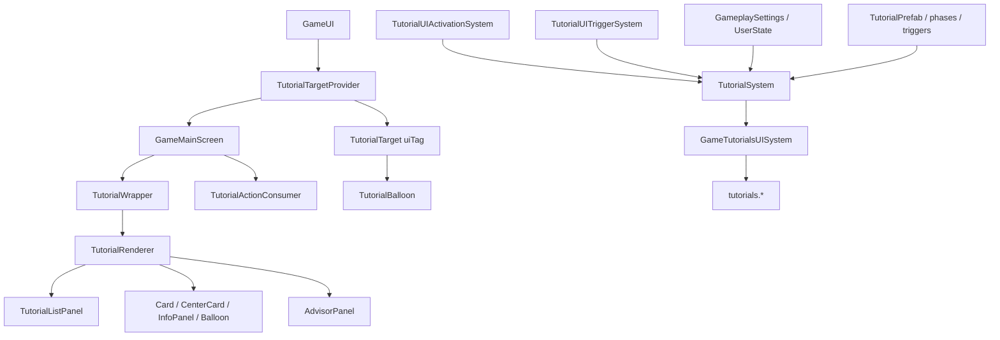

# Vanilla tutorial system (frontend + backend)

Research reference for Cities Skylines II tutorials: UI components, UI bindings, Managed C# systems/prefabs/settings, trigger and “already seen” flows, and how that informs a **parallel XTM tutorial stack**.

**This document is research + product decisions only.** No XTM tutorial implementation is described as done.

---

## Sources

| Source | Path / note |
|---|---|
| Extracted UI modules | `_ModsMCP/dist/ui-modules/` via `kcs2m_ui_modules_lookup` |
| Tutorial UI | `game-ui/game/components/tutorials/**` |
| Tutorial bindings | `game-ui/game/data-binding/tutorial-bindings.ts`, `editor-tutorial-bindings.ts` |
| Typed API (may lag) | `_Frontends/UI/k45-xtm-vuio/types/bindings.d.ts` → `tutorial` namespace |
| Backend cache | via `kcs2m_backend_search` / `kcs2m_backend_context` on `Game.dll` |
| Core systems | `Game/Tutorials/TutorialSystem.cs`, `EditorTutorialSystem.cs` |
| UI binders | `Game/UI/InGame/TutorialsUISystem.cs`, `GameTutorialsUISystem.cs`, `Game/UI/Editor/EditorTutorialsUISystem.cs` |
| Prefabs | `Game/Prefabs/Tutorial*.cs` |
| Settings | `Game/Settings/GameplaySettings.cs`, `UserState.cs`, `EditorSettings.cs` |
| XTM settings host (future) | [`BelzontTLM/XTMModData.cs`](../../BelzontTLM/XTMModData.cs) (`[FileLocation("K45_XTM_settings")]`) |

---

## End-to-end architecture

Parallel **editor** stack: `EditorTutorialSystem` + `EditorTutorialsUISystem` + binding group `"editorTutorials"` + `EditorSettings.shownTutorials`.

---

## Binding / settings surface

| Layer | Game | Editor |
|---|---|---|
| UI binding group | `"tutorials"` | `"editorTutorials"` |
| Enabled binding | `tutorialsEnabled` | `editorTutorialsEnabled` |
| UI system | `GameTutorialsUISystem` : `TutorialsUISystem` | `EditorTutorialsUISystem` : `TutorialsUISystem` |
| Logic system | `TutorialSystem` | `EditorTutorialSystem` : `TutorialSystem` |
| Settings property | `GameplaySettings.showTutorials` | `GameplaySettings.showEditorTutorials` |
| Shown dict | `UserState.shownTutorials` (`[FileLocation("UserState")]`) | `EditorSettings.shownTutorials` |
| Autoplay | `UserState.autoplayTutorials` | (game UserState; editor UI has less surface) |

Both UI systems expose enable as `() => m_TutorialSystem.tutorialEnabled`. Base `TutorialSystem.tutorialEnabled` read/writes `showTutorials`; editor override uses `showEditorTutorials`. Disabling sets `mode = TutorialMode.Default`.

Options:

- `GameplaySettings.showTutorials` / `showEditorTutorials` / `resetTutorials` (clears **both** user + editor shown dicts and calls `OnResetTutorials`)
- Menu also binds `menu.showTutorials` / `ApplyTutorialSettings`
- `showEditorTutorials` lives on the same `GameplaySettings` class (settings file `"Settings"`) as `showTutorials`; editor UI additionally exposes `editorTutorials.toggleTutorials`

### Core UI bindings (`tutorials.*`)

**Values:** `tutorialsEnabled`, `introActive`, `listIntroActive`, `listOutroActive`, `activeList`, `next`, `pending`, `categories`, `groups`, `tutorials` (map), `activeTutorial`, `activeTutorialPhase`, `autoplayTutorials`

**Triggers:** `activateTutorial`, `activateTutorialPhase`, `forceTutorial`, `completeActiveTutorialPhase`, `completeActiveTutorial`, `completeIntro`, `completeListIntro`, `completeListOutro`, `setAutoplayTutorials` / `setAutoplayTutorials`, `setTutorialTagActive`, `activateTutorialTrigger`, `disactivateTutorialTrigger`

Frontend helpers: `useTutorialTagActivation` → `setTutorialTagActive`; `useTutorialTagTrigger` → activate/disactivate; `useTutorialTag` = both.

---

## Frontend components

| Component | Role |
|---|---|
| `TutorialTargetProvider` | Root context; syncs blink/balloon tags from active phase |
| `TutorialTarget` | Wraps a UI child with `uiTag`; blink + balloon attach + highlight |
| `TutorialWrapper` / container | Intro / list intro / list outro / renderer; focus keys |
| `TutorialRenderer` | Advisor + task list + Card / CenterCard / InfoPanel by phase type |
| `TutorialListPanel` | Tasks by category; completed UI; start via `forceTutorial` |
| `TutorialLayout` / phase panels | Shared title/desc/image/trigger checkbox/next-prev |
| `TutorialBalloon` | Anchors balloon content to a `TutorialTarget` |
| `TutorialActionConsumer` | Continue / Finish / Previous / Close / Start Next / Advisor |
| `AdvisorPanel` | Glossary catalog; `forceTutorial(..., advisorActivation=true)` |
| Editor twin | `EditorTutorialContainer` + `editorTutorials.*` |

**Phase types:** `Balloon=0`, `Card=1`, `CenterCard=2`, `InfoPanel=3` (C# has `TutorialInfoPanelPrefab`; typed `bindings.d.ts` currently omits `InfoPanel`).

Widgets may carry `tutorialTag` (`WidgetTutorialTarget`). Prefabs / `manualUITags$` supply string `uiTag`s.

Mount path: `GameUI` → `TutorialTargetProvider` → `GameMainScreen` → `TutorialWrapper` + `TutorialActionConsumer`.

---

## Backend systems and prefabs

### Core

- `TutorialSystem` — mode machine, active tutorial/list, completion, settings sync
- `EditorTutorialSystem` — filters queries with `EditorTutorial`; own enable + shown dict

### UI binders

- `TutorialsUISystem` — shared bind/trigger registration under `"tutorials"`
- `GameTutorialsUISystem` / `EditorTutorialsUISystem` — enable, intro modes, categories

### Activation systems (mark `TutorialActivated`)

Examples: `TutorialUIActivationSystem`, `TutorialAutoActivationSystem`, `TutorialControlSchemeActivationSystem`, `TutorialInfoviewActivationSystem`, `TutorialObjectSelectedActivationSystem`, fire/health/event variants.

### Trigger systems (complete phase triggers)

Examples: `TutorialUITriggerSystem`, `TutorialInputTriggerSystem`, placement/selection/zoning/area/policy/upgrade.

### Prefabs (`ComponentMenu` under `Tutorials/`)

| Prefab | Role |
|---|---|
| `TutorialPrefab` | phases[], priority, category (None/ZoneBasics/UtilityBasics), mandatory, replaceActive, editorTutorial, fireTelemetry |
| `TutorialPhasePrefab` | image / PS/Xbox overrides, icon, title/description visible, canDeactivate, controlScheme, trigger, overrideCompletionDelay |
| `TutorialBalloonPrefab` | `m_UITargets[]` (uiTag, direction, alignment, corner, hideArrow, highlightUiElement) |
| `TutorialCardPrefab` / `TutorialInfoPanelPrefab` | other phase presentations |
| `TutorialUITriggerPrefab` | `m_UITriggers[]` (tag provider, goToPhase, disableBlinking, completeManually); phase branching when goToPhase set |
| Activations | `TutorialUIActivation`, auto/advisor/controlScheme/infoview/… |
| Lists / config | `TutorialListPrefab`, `TutorialsConfigurationPrefab` |
| Advisor groups | `UITutorialGroupData` / editor variant |

### Runtime ECS markers (non-exhaustive)

`TutorialActive`, `TutorialCompleted`, `TutorialShown`, `TutorialPhaseActive` / `Completed` / `Shown`, `TutorialActivated`, `ForceActivation`, `AdvisorActivation`, `TriggerActive` / `Completed` / `PreCompleted`, `TutorialNextPhase`, `EditorTutorial`, `ReplaceActiveData`.

---

## How a tutorial is triggered

Frontend does **not** decide world-state start conditions. It reacts to bindings and can request activation.

1. **Activation systems** add `TutorialActivated` when conditions match (e.g. UI tag present).
2. **`TutorialSystem`** promotes pending → active when enabled (and delays/modes allow).
3. **UI requests:**
   - `activateTutorial(entity)` → `SetTutorial(tutorial, Null)`
   - `activateTutorialPhase(t, p)` → `SetTutorial(t, p)`
   - `forceTutorial(t, p, advisorActivation)` → add `ForceActivation` (+ optional `AdvisorActivation`) then `SetTutorial`
4. **UI tags:** `setTutorialTagActive` → `TutorialUIActivationSystem.SetTag`; `activateTutorialTrigger` / `disactivateTutorialTrigger` → `TutorialUITriggerSystem`.
5. **Intro:** `completeIntro(bool)` sets `mode = Default` and `tutorialEnabled = bool`. Special shown-dict keys: `WelcomeIntro`, `ListIntro`, `ListOutro`.
6. **Autoplay / next:** `next` = first incomplete non-active tutorial in active list; UI may `forceTutorial` it.

### UI activation algorithm (`TutorialUIActivationSystem`)

1. On load / create: build map `uiTag → List<tutorial entity>` from `TutorialUIActivation.m_UITagProvider.uiTag` (pipe-split).
2. `SetTag(tag, active)` adds/removes tag from `m_ActiveTags` if mapped.
3. Each update: for each active tag, for each incomplete tutorial, add `TutorialActivated`; if `!UIActivationData.m_CanDeactivate`, also add `ForceActivation`.

### UI trigger algorithm (`TutorialUITriggerSystem`)

1. Frontend mounts → `ActivateTrigger(tag)` adds to `m_ActivatedTriggers`.
2. For active triggers (`UITriggerData` + `TriggerActive`, not `TriggerCompleted`): if any pipe-split tag is in the set:
   - with `m_GoToPhase` → `TutorialNextPhase` + `TriggerPreCompleted`
   - else if `m_CompleteManually` → `TriggerPreCompleted`
   - else → `TriggerCompleted`
3. Then `ManualUnlock` and remove that tag from the activated set.

### Enable vs advisor when tutorials are off

In `TutorialSystem.OnUpdate` (Default mode):

- List advancement only if `tutorialEnabled`
- Active tutorial update if `tutorialEnabled` **or** active tutorial has `AdvisorActivation`
- Else clear locks and clear active tutorial/list

So advisor-forced tutorials can still advance while the master toggle is off; ordinary auto-activation does not.

---

## How “already seen” is marked

### Two layers

1. **Persistent (player settings, not city save):** `Dictionary<string,bool> shownTutorials` keyed by **prefab.name**. Written in `UpdateSettings(name, passed)` via `TryAdd` / set true + `ApplyAndSave()` on `UserState` or `EditorSettings`.
2. **Session ECS:** on complete (`CleanupTutorial(..., passed: true)`): `SetTutorialShown`, add `TutorialCompleted` (phases: `TutorialPhaseCompleted`), then `UpdateSettings`. Unlock events may fire via `ManualUnlock`.

### Restore on load (`ReadSettings`)

Called from `OnGameLoadingComplete`:

| Dict entry | Effect |
|---|---|
| Missing key | Not started / not shown |
| `true` | Treat as **passed** → `CleanupTutorial` / list cleanup (`TutorialCompleted` etc.) without rewriting settings |
| `false` | Treat as **shown but not completed** → `SetTutorialShown` only; for tutorials, also mark phases whose names appear in the dict as shown |

Special keys: `WelcomeIntro`, `ListIntro`, `ListOutro` gate intro modes (presence / value checks).

UI “completed” checkbox = ECS/DTO `completed` from `TutorialsUISystem.BindTutorial`.

Reset: `GameplaySettings.resetTutorials` → clear both dicts + `TutorialSystem` / `EditorTutorialSystem.OnResetTutorials()`.

**Disk:** `UserState` uses `[FileLocation("UserState")]`, `GameplaySettings` uses `[FileLocation("Settings")]` — Colossal settings under the game user profile (per-user), not the city save.

---

## Separate enable key than vanilla tutorials?

**Within `"tutorials"` / `TutorialSystem`:** no. One master flag: `showTutorials` ↔ `tutorialsEnabled`.

**As a parallel system:** yes — vanilla already does this with editor:

- `showEditorTutorials` + `"editorTutorials"` + `EditorTutorialSystem` + separate shown dict

Anything that only binds to `tutorials.*` **shares** `showTutorials`. An independent mod toggle must follow the **editor pattern**: own settings bool + own shown storage + own binder group + parallel driver.

---

## Typed-bindings gaps vs extracted UI / C#

Present in extracted UI / C# but lagging or missing in `bindings.d.ts` (refresh deferred to implementation; also update `_Frontends/UI/_shared/vuio-commons` when shared):

- Phase type `InfoPanel`
- `highlightTargets` / fuller balloon target fields (`cornerAlignment`, `hideArrow`, `highlightUiElement`)
- Tutorial `category` (`TutorialCategory`)
- List flags (`enableAutoCollapse` / `Expand`, `disabledVisible`, `hintsVisible`)
- Phase `scrollable` / `autoScroll` / control-scheme filters (UI-side)
- Some `manualUITags` entries used in code (e.g. tutorial list panel) may be absent from typed `ManualUITagsConfiguration`

---

## XTM implementation decisions

| Area | Decision |
|---|---|
| Architecture | **Parallel stack** (editor-like); binder group e.g. `k45::xtm.tutorials.*`; **no** passthrough of vanilla `tutorials.*` |
| Vanilla UI reuse | Reuse game React shells (`TutorialTarget`, `TutorialRenderer`, `TutorialLayout`, balloons/cards) wired to **mod** bindings |
| Vanilla chrome | **Never** appear in vanilla advisor / task list; mod-owned entry points only |
| i18n | Mod keys only (`K45::XTM` via `*_entries.txt`) |
| Enable toggle | `XTMModData` → **Tutorials** section; **default ON**; **fully independent** of `showTutorials` |
| Entry / discovery | Auto-offer on **first open** of XTM main UI |
| Launcher (v1) | **TutorialRenderer only** — no task list; start tutorials individually from mod UI |
| Persistence | Private completed dict in **`XTMModData`**; bool completed (`true` = done, absent = not started); same dict for first-open flag (e.g. `XTM/FirstOpenIntro`); **independent** of vanilla `resetTutorials` |
| v1 content | Shell + **one smoke-test** hardcoded DTO (all phase types / uiTags); real content later |
| Encyclopedia | Separate ids; **cross-link** from encyclopedia to launch matching tutorial |
| Tags / triggers | Mirror vanilla (`useTutorialTag*`, force vs activate) against mod bindings |
| Toggle OFF | **Hard block** — no activation, rendering, or tag handling |

Vanilla `tutorials.*` / `TutorialSystem` are **reference only** for the parallel driver — do not inject mod prefabs into the stock game binder.

---

## Desired kcs2m enhancement

**Content-search over extracted UI modules** (body text), so agents can find `TutorialTarget` / `useTutorialTag` / concrete `uiTag` call sites without browsing game UI sources on disk. Path-only `kcs2m_ui_modules_lookup` cannot answer that today.

---

## Vanilla research backlog

Items not fully resolved for packaging / deep phase-state machine (MCP-sufficient for XTM shell design):

| Topic | Status |
|---|---|
| Shipped prefab packaging / asset-database cook paths | Open — prefab types known; content packaging not traced |
| Full phase-advance state machine inside `UpdateActiveTutorial` | Partially covered; enough for force/activate/complete contracts |
| `ReplaceActiveData` vs mandatory tutorial priority | Open detail |
| Editor autoplay settings path | Thin — game uses `UserState.autoplayTutorials` |
| Exact Colossal disk path under AppData for `UserState` | Known as settings file name `"UserState"`; full OS path not required for XTM |

---

## When implementing XTM tutorials

1. Add enable + completed dict to `XTMModData` (Tutorials section).
2. Own binder group + driver mirroring force/activate/tag/trigger contracts above.
3. Wire reused vanilla React tutorial components to mod bindings.
4. First-open prompt + smoke-test DTO; hard-block when toggle off.
5. Refresh `bindings.d.ts` + vuio-commons tutorial types during that task (not part of this research doc).
6. Later: encyclopedia cross-links and real content DTOs.
